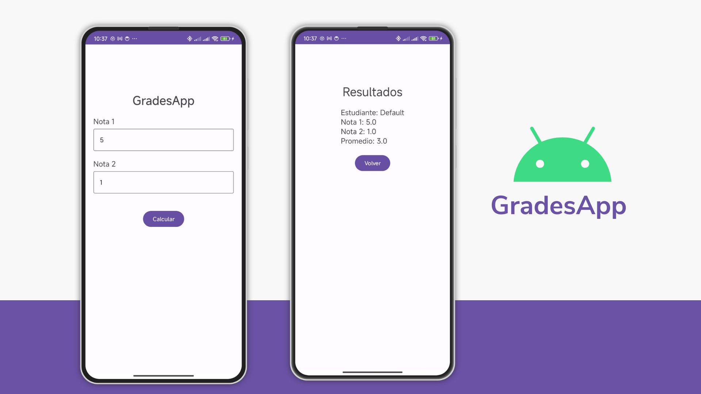

# GradesApp

  

Esta aplicación es una práctica de Android Studio para el manejo de varias herramientas de desarrollo en Android. La app calcula el promedio de calificaciones de un estudiante. Esta práctica se hizo siguiendo los pasos del repositorio [new_grades_app](https://github.com/sebastianmr18/new_grades_app)

## Temas Cubiertos

1. **Dependencias y Configuración Inicial**

   - Se agregan dependencias necesarias para `dataBinding`, `fragments` y `cardView`, preparando el proyecto para un desarrollo fluido.

2. **Arquitectura MVVM**

   - Separación de lógica de negocio y UI, mejorando la mantenibilidad del código.

3. **Fragmentos y Navegación**

   - Implementación de dos fragmentos (`FirstFragment` y `SecondFragment`) con navegación a través de un `nav_graph`.
   - Definición de `FirstFragment` como pantalla inicial y navegación entre fragmentos.

4. **dataBinding**

   - Uso de `dataBinding` para conectar la lógica con la UI, simplificando el manejo de vistas.

5. **Paso de Datos entre Fragmentos**

   - Implementación de `Bundle` para pasar objetos serializables como un objeto `Student` entre fragmentos.

6. **Estilos de Material Design**
   - Aplicación de estilos `Material Design` y refinamiento de la presentación de la interfaz.
